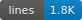
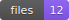
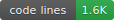

# Knowtif Browser Extension







Receive real-time GitHub notifications from the [knowtif](https://github.com/NagusameCS/knowtif) npm package directly in your browser.

---

## Features

| Feature | Description |
|---------|-------------|
| **Real-time Notifications** | Receive push notifications via ntfy.sh SSE stream |
| **Notification History** | View all past notifications in the popup panel |
| **Browser Notifications** | Native browser notifications with auto-dismiss |
| **Fully Customizable** | Complete control over colors and timing |
| **Cross-Browser** | Works on Chrome, Firefox, Edge, and Opera |

---

## How It Works

```
Your Repository
      |
      v
GitHub Action (knowtif runs)
      |
      v
   ntfy.sh (notification hub)
      |
      v
Browser Extension (SSE subscription)
      |
      v
Browser Notifications + History Panel
```

---

## Installation

### Chrome / Edge / Opera

1. Download or clone this repository
2. Run `npm run build` to build the extension
3. Open your browser's extension page:
   - Chrome: `chrome://extensions`
   - Edge: `edge://extensions`
   - Opera: `opera://extensions`
4. Enable "Developer mode"
5. Click "Load unpacked" and select the `dist` folder

### Firefox

1. Download or clone this repository
2. Run `npm run build:firefox` to build for Firefox
3. Open `about:debugging#/runtime/this-firefox`
4. Click "Load Temporary Add-on"
5. Select any file in the `dist-firefox` folder

---

## Quick Start

### Step 1: Set up knowtif in your repository

```bash
npx knowtif init
```

During setup, when prompted for a destination, choose **"Browser (ntfy.sh)"**. This will generate a unique topic name.

### Step 2: Configure the extension

1. Click the Knowtif extension icon
2. Click "Settings"
3. Enter your ntfy.sh topic name
4. Click "Save settings"

The extension will automatically connect and start receiving notifications!

---

## Testing

### Method 1: Use the Test button

Click the extension icon, then click "Test" to send a test notification.

### Method 2: Send from terminal

```bash
curl -d "Test notification" \
  -H "Title: Test Alert" \
  -H "Tags: white_check_mark" \
  ntfy.sh/YOUR_TOPIC_NAME
```

### Method 3: Trigger a real notification

Push a commit to a repository that has knowtif configured.

---

## Configuration

| Setting | Default | Description |
|---------|---------|-------------|
| ntfy.sh Topic | - | Your unique topic from knowtif setup |
| ntfy.sh Server | `https://ntfy.sh` | Server URL (for self-hosted) |
| Auto-connect | `true` | Connect automatically on browser startup |
| Show notifications | `true` | Enable browser notifications |
| Auto-dismiss (ms) | `5000` | Time before notification disappears |
| Play sound | `false` | Play sound on notification |

### Color Customization

Customize notification colors for each type:
- **Info** (blue): Push, PR opened, new issue
- **Success** (green): CI passed, deployment successful
- **Failure** (red): CI failed, deployment failed

---

## Publishing to Web Stores

### Chrome Web Store

1. Create a developer account at [Chrome Web Store Developer Dashboard](https://chrome.google.com/webstore/devconsole)
2. Pay the one-time $5 registration fee
3. Build and package: `npm run build && npm run package`
4. Upload `knowtif-chrome.zip`
5. Fill in store listing details
6. Submit for review

### Firefox Add-ons (AMO)

1. Create account at [Firefox Add-on Developer Hub](https://addons.mozilla.org/developers/)
2. Build: `npm run build:firefox && npm run package:firefox`
3. Upload `knowtif-firefox.zip`
4. Fill in listing details
5. Submit for review

### Microsoft Edge Add-ons

1. Create account at [Microsoft Partner Center](https://partner.microsoft.com/dashboard/microsoftedge/overview)
2. Use the Chrome build: `npm run build && npm run package`
3. Upload `knowtif-chrome.zip` (Edge supports Chrome extensions)
4. Fill in store listing
5. Submit for review

### Opera Add-ons

1. Create account at [Opera Addons Developer Portal](https://addons.opera.com/developer/)
2. Use the Chrome build: `npm run build && npm run package`
3. Upload `knowtif-chrome.zip`
4. Fill in listing details
5. Submit for review

---

## Development

```bash
# Build for Chrome/Edge/Opera
npm run build

# Build for Firefox
npm run build:firefox

# Package for distribution
npm run package        # Creates knowtif-chrome.zip
npm run package:firefox # Creates knowtif-firefox.zip

# Clean build artifacts
npm run clean
```

### Project Structure

```
knowtif-extension/
├── manifest.json          # Chrome/Edge/Opera manifest (v3)
├── manifest-firefox.json  # Firefox manifest (v2)
├── src/
│   ├── background.js      # Service worker, SSE connection
│   ├── popup.html         # Extension popup UI
│   ├── popup.js           # Popup logic
│   ├── options.html       # Settings page
│   └── options.js         # Settings logic
├── icons/                 # Extension icons (16, 32, 48, 128px)
└── dist/                  # Built extension (Chrome)
└── dist-firefox/          # Built extension (Firefox)
```

---

## Privacy

- All notification history stored locally in browser storage
- Connects directly to ntfy.sh, no intermediary servers
- No authentication required (uses unique topic names)
- Open source for full transparency

---

## Troubleshooting

### Not receiving notifications?

1. Check that your topic name matches exactly
2. Look for the connection status in the popup
3. Try clicking "Connect" manually
4. Check browser notification permissions

### Connection keeps dropping?

- ntfy.sh may have rate limits
- Consider self-hosting ntfy
- Check network/firewall settings

---

## License

MIT
